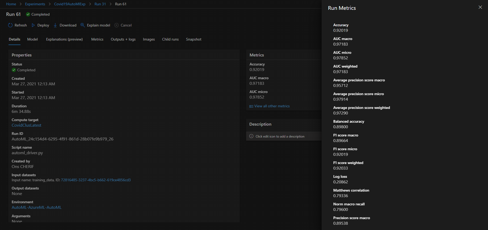

# Covid19 New Cases Classification

Since December 2019 we have been facing a global pandemic that changed the world for ever.
The origin of Corona Virus was Wuhan-China and from there it passed from epidemic to pandemic. <br>
A lot of researchs has revealed that the infection's globalization was caused by a mutation in the spike protein of the SARS-CoV-2, that has dramatically increased its transmissibility between humans and animals.<br>
 
 Thus several lockdowns and preventions has been globally applied, we faced a considerable death rate all over the world.<br>
 During this project we will be using a Covid19 dataset that gathers all possible information about its propagation and the globally occured damage. <br>
 This project is about training a Machine Learning model to predict new cases and their origin using Microsoft Azure ML Studio to prepare, train and deploy the best model as a webservice.
 

## Project Details
* [Project Architecture](#project-architecture)
* [Project Set Up and Installation](#project-set-up-and-installation)
* [Dataset](#dataset)
  * [Overview](#overview)
  * [Task](#task)
  * [Access](#access)
* [Automated ML](#automated-ml)
  * [Results](#results)
* [Hyperparameter Tuning](#hyperparameter-tuning)
  * [Results](#results)
* [Model Deployment](#model-deployment)
* [Screen Recording](#screen-recording)
* [Standout Suggestions](standout-suggestions)
* [Improvements and Future Work](#improvements-and-future-work)
* [References](#references)

## Project Architecture

*Figure 1 : The following diagram shows the overall architecture and workflow of the project.*


## Project Set-Up and Installation

Being familiar with Microsoft Azure and how it works, it was pretty simple to run this project.<br>

Since it's a Udacity project, there is an existing Microsoft subscription `Udacity CloudLabs Sub - 15` and a resource group `aml-quickstarts-141033`, but for my case I used my personal Microsoft Azure. 

We can resume this envioronement set up to three major sections:<br>

### Create a Workspace:

A workspace is a top-level resource needed to use all services within Microsoft Machine Learning. As defined within Microsoft's documentation: <br>
> A Workspace is a fundamental resource for machine learning in Azure Machine Learning. You use a workspace to experiment, train, and deploy machine learning models. <br>
> Each workspace is tied to an Azure subscription and resource group and has an associated SKU.
> -- <cite>[Microsoft Azure Worksapce][1]</cite>

I used the same documentation to create a workspace, but if we were using Udacity's Account, there is a pre-created workspace named `quick-starts-ws-141033`.

### Set up a Compute Instance:

Once we created a workspace to hold all our experiments and trained models, we need to create a compute instance to run our scripts using Notebooks under Studio ML.
A compute Instance helps data science community to use pre-built Azure Machine Learning functionalities, manage security and performance. 

Microsoft defines a compute instance as: <br>
> A compute instance is a fully managed cloud-based workstation optimized for your machine learning development environment.<br>
> Azure Machine Learning compute instance enables you to author, train, and deploy models in a fully integrated notebook experience in your workspace.<br>
> -- <cite>[Microsoft Azure Compute Instance][2]</cite>


We just need to install required libraries already been gathered within the requirements.txt file under the starter_file directory. I used the Microsoft Azure ML Studio embedded Terminal to run `pip install -r requirements.txt` and install the desired packages. <br>

## Dataset

### Overview

I used a <cite>[Covid19 World Dataset][3]</cite> provided by *Our World in Data* Github repository containing the historical data about this pandemic.<br>

### Task

Generally speaking, Covid19 pandemic is coming from a virus mutation called SARS. Within this project I chose to train a model for new case predictions per country to provide further visibility & statistics.<br>
The task is to classify `new_cases` to `0` or `1` i.e to predict new Covid19 infections. <br>

This dataset contains a total number of 59 feature. Below an explanation of some of them:

  * `iso_code` : ISO 3166-1 alpha-3 – three-letter country codes.
  * `continent` : Continent of the geographical location
  * `location` : Geographical location
  * `total_cases` : Total confirmed cases of COVID-19
  * `total_deaths` : Total deaths attributed to COVID-19
  * `new_deaths` : New deaths attributed to COVID-19
  * `reproduction_rate` : Real-time estimate of the effective reproduction rate (R) of COVID-19.
  * `icu_patients` : Number of COVID-19 patients in intensive care units (ICUs) on a given day
  * `hosp_patients` : Number of COVID-19 patients in hospital on a given day.
  * `new_tests` : New tests for COVID-19 (only calculated for consecutive days)
  * `total_tests` : Total tests for COVID-19.
  * `tests_units` : Units used by the location to report its testing data
  * `total_vaccinations` : Total number of COVID-19 vaccination doses administered
  * `people_vaccinated` : Total number of people who received at least one vaccine dose.
  * `population` : Population in 2020.
  * `population_density` : Number of people divided by land area, measured in square kilometers, most recent year available
  * `cardiovasc_death_rate` : Death rate from cardiovascular disease in 2017 (annual number of deaths per 100,000 people)
  * `diabetes_prevalence` : Diabetes prevalence (% of population aged 20 to 79) in 2017
  * `life_expectancy` : Life expectancy at birth in 2019.
  * `new_cases` : New confirmed cases of COVID-19.
  
Out of a 59 feature, I will be using only 38 including the ones mentioned above, along with my target column: `new_cases`. 

### Data Analysis

Before digginh into cleaning, splitting, training and testing. I began with the first phase whatever was the project or the problem to solve: Data Analysis and exploring.<br>

Being able to know the strenghts and the weaknesses of our data is really important to pick the features and perfrom the cleaning before training the model.<br>

I used the Pandas-Profiling library to visualize and generate a complete report about the data, the warnings, the individual parameters check, and all kind of test we may think of as a first step to know more about what we will be using. The generated report is accessible from <cite>[here][4]</cite> or explore directly the <cite>[Covid19DatasetAnalysis][5]</cite> notebook. <br>

### Access
In order to be able to use the dataset, I downloaded it using `TabularDatasetFactory` and stored it within a datastore using the `register` function as shown with the below screenshot:


## Automated ML

### Overview
Exploring Automl, its utility and the way it works, makes me realize how I love this field and how much there is to learn.
I tried a wide range of settings and parameters, and what I can conclude is that whatever combination I used do really matter and directly impacts my model training.<br>

To start let's define what is Automl and whew we use it, and for that we cnat's find better then Microsft's documentation:<br>
> Automated machine learning, also referred to as automated ML or AutoML, is the process of automating the time consuming, iterative tasks of machine learning model development. It allows data scientists, analysts, and developers to build ML models with high scale, efficiency, and productivity all while sustaining model quality. 
> --<cite>[Automated ML][6]</cite>

Automated machine learning is the process of automating the time consuming, iterative tasks of machine learning model development. 

AutoML is used to automate the repetitive tasks by creating a number of pipelines in parallel that try different algorithms and parameters. This iterates through ML algorithms paired with feature selections, where each iteration produces a model with a training score. The higher the score, the better the model is considered to fit the data. This process terminates when the exit criteria defined in the experiment is satisfied.

### AutoML Configuration

Instantiate an AutoMLConfig object for AutoML Configuration. The parameters used here are:

* `n_cross_validation = 5` : Typically, when it comes to k-fold cross-validation parameter tuning within Machine learning projects to use k = 5 or k=10, as these values have been shown empirically to yield test error rate estimates that suffer neither from excessively high bias nor from very high variance.
* `primary_metric = 'accuracy'` : The primary metric parameter determines the metric to be used during model training for optimization. Accuracy primary metric is chosen for binary classification dataset.
* `enable_early_stopping = True` : Whether to enable early termination if the score is not improving in the short term.
* `experiment_timeout_hours = 1.0` : Maximum amount of time in hours that all iterations combined can take before the experiment terminates.
* `max_concurrent_iterations = 4` : To help manage child runs and when they can be performed, we match the number of maximum concurrent iterations of our experiment to the number of nodes in the cluster. So, we get a dedicated cluster per experiment.
* `task = 'classification'` : This specifies the experiment type as classification.
* `compute_target = cpu_cluster` : Azure Machine Learning Managed Compute is a managed service that enables the ability to train machine learning models on clusters of Azure virtual machines. Here compute target is set to cpu_cluster which is already defined with 'STANDARD_D2_V2' and maximum nodes equal to 4.
* `training_data = train_data` : This specifies the training data to be used in this experiment which is set to train_data which is a part of the dataset uploaded to the datastore.
* `label_column_name = 'new_cases'` : The target column here is set to DEATH_EVENT which has values 1 if the patient deceased or 0 if the patient survived.
* `featurization= 'auto'` : This indicates that as part of preprocessing, data guardrails and featurization steps are performed automatically.
* `model_explainability = True`: Whether to enable explaining the best AutoML model at the end of all AutoML training iterations.
* `debug_log = "Covid_automl_errors.log"`: The log file to write debug information to. If not specified, 'automl.log' is used.

As showing below, this is how I configured my Automl settings:

```
# Configure Automl settings
automl_settings = {
    "n_cross_validations": 5,
    "primary_metric": 'accuracy',
    "enable_early_stopping": True,
    "experiment_timeout_hours": 1.0,
    "max_concurrent_iterations": 4,
}
automl_config = AutoMLConfig(task = 'classification',
                             compute_target = cpu_cluster,
                             training_data = training_dataset,
                             label_column_name = 'new_cases',
                             featurization= 'auto',
                             path=project_folder,
                             model_explainability=True,
                             debug_log = "Covid_automl_errors.log",
                             **automl_settings)
```
### Results
*TODO*: What are the results you got with your automated ML model? What were the parameters of the model? How could you have improved it?

Once the experiment is submitted, a bunch of jobs will be queued before starting the training phrase such as: 

  * FeaturesGeneration
  * DatasetFeaturization
  * DatasetCrossValidationSplit
  * ModelSelection
  
It's easy to follow the run experiment by specifying `show_output=True` when submitting the experiment:
 

 
Once the experiment is successfully completed, we can Run the `RunDetails` from the `Widget` library to visualize the diffrenet trained models, their status, the run Id and much more. Take a look at the below screenshot for more details: <br>
 

 
*Next, a scatter plot is generated to show the accuracy during the experiment and a plot using Pearson's Correlation: *
  

  


*The figure below explains the ROC for the AutoML run:*


*New Cases clustered for Africa's continent:*


*Individual Feature Importance Plot for all the Covid19 cases:*
  

 
To explore the best model, which is VotingEnsemble, I retrieved it using `get_output()` function then played with it's metrics and different parameters using `get_metrics()`, as shown below:

```
# Retrieve and save best model.
best_automl_run, best_automl_model = remote_run.get_output()
```

  * The best AutoML Run Details with its Run Id is shown below :
  
  
  
  * Explore the metrics of the best model:
  
  
  
  or directly from the Experiment section from Automl Studio portal: 
 
  
  
  

## Hyperparameter Tuning

It is common for classification models to predict a continuous value as the probability of a given example belonging to each output class.<br>

Since I am dealing with a binary classification problem based on labeled inputs and discrete outputs, I used a logistic regression algorithm from Scikit-learn to calculate probabilities of new cases by country based on several features within a training dataset.<br>

Using HyperDrive is like automating a manual process to figure out the best combination of parameters your model needs to prevent the over/down-fitting. It is a repeatable process for each run of the experiment, specifying a random hyperparameter from a given list of choices.<br>

To prepare the HyperDrive configuration, we need to set three major parameters including:<br>

*1- Specify a parameter sampler: * There are three types of sampling: Bayesian, random or Grid sampling, which supports discrete hyperparameters with the possibility to exhaustively search over the search space with a possibility of an early termination of low-performance runs.<br>

Here is a code snippet of the GridSampling definition with 2 parameters:

``` 
param_sampling = GridParameterSampling( 
    {
        '--C': choice(0.01, 0.1, 1, 10, 100), 
        '--max_iter': choice(25, 50, 100,150)
    }
)
```
* `--C` :  The inverse of regularization strength `C` with a default value of 1.0, you need to specify a discrete set of options to sample from. I used a range between _0.01 and 100_ to test the limits of regularization strenght and what is it's effect on the model.
* `--max_iter`:  the maximum number of iterations taken for the solvers to converge `max_iter`. I chose four max iteration parameters: _25, 50, 100 and 150_.

*2- Specify an early termination policy:* Among three types, I decided to work with the Bandit Policy, classified as an _aggressive saving_, as it will terminate any job based on slack criteria, and a frequency and delay interval for evaluation.

* `slack_factor`: Specified as a ratio used to calculate the allowed distance from the best performing experiment run.
* `evaluation_interval`: Reflects the frequency for applying the policy.
* `delay_evaluation`: Reflects the number of intervals for which to delay the first policy evaluation.

*3- Create a SKLearn estimator:* 
The estimator contains the source directory, the path to the script directory, the compute target and the entry script which refers to the script's name to use along with the experiment. In my case, I used [TrainCovid19Infections.py](starter_file/TrainCovid19Infections.py).<br>

After creating the HyperDriveConfig using the mentioned above parameters, we submit the experiment by specifying the recently created HyeperDrive configuration:
* `primary_metric_name`: The name of the primary metric needs to exactly match the name of the metric logged by the training script. Since I chose the Accuracy metric in my training script, I will be using the same within my HyperDriveConfig.
* `primary_metric_goal=PrimaryMetricGoal.MAXIMIZE`: Primary metrinc goal is aiming to Maximized or Minimized the chosen primary metric. For this project I chose to Maximize the `accuracy` _primary metric_.
``` 
hyperdrive_run_config = HyperDriveConfig(
                                   hyperparameter_sampling = param_sampling,
                                   primary_metric_name = 'Accuracy',
                                   primary_metric_goal=PrimaryMetricGoal.MAXIMIZE,
                                   max_total_runs=100,
                                   max_concurrent_runs = 3,
                                   policy = early_termination_policy,
                                   estimator = estimator)
``` 


### Results
*TODO*: What are the results you got with your model? What were the parameters of the model? How could you have improved it?

Once the experiment is submited, sevral runs will be queued to training each a different model while tuning the hyperparameters. When the experiment is complete, I extracted the details of the submitted run via `RunDteails` widget as shown below:


Below the experiment's regularization strength chart, showing the coordination between the different runs during the experiment within the `--C` parameter:


After getting the experiment's result, I extracted the best model using `get_best_run_by_primary_metric()` and its parameters using `get_metrics()`. In my case the Accuracy of the best model is  _0.740_ with a _--c= 0.1_ and a _--max_iter= 25_ like shown in the screenshots below:


Last but not least, I registered the best model using `register_model` function and printed out its name and version:

```
#Save the best model
Hyp_DrCovid19_Model = best_run_HyperDr.register_model(model_name="HyperDrCovid19Model", model_path='outputs/model.joblib')
print(Hyp_DrCovid19_Model.name,": Version Number",Hyp_DrCovid19_Model.version, sep='\t')
```

## Model Deployment
*TODO*: Give an overview of the deployed model and instructions on how to query the endpoint with a sample input.

## Screen Recording
*TODO* Provide a link to a screen recording of the project in action. Remember that the screencast should demonstrate:
- A working model
- Demo of the deployed  model
- Demo of a sample request sent to the endpoint and its response

## Standout Suggestions
*TODO (Optional):* This is where you can provide information about any standout suggestions that you have attempted.


[1]: https://docs.microsoft.com/en-us/python/api/azureml-core/azureml.core.workspace.workspace?view=azure-ml-py

[2]: https://docs.microsoft.com/en-us/azure/machine-learning/concept-compute-instance

[3]: https://covid.ourworldindata.org/data/owid-covid-data.csv

[4]: https://github.com/ons-cherif/GraduationUdacityProject/blob/master/starter_file/outputs/DataCleaningReport.html

[5]: https://github.com/ons-cherif/GraduationUdacityProject/blob/master/starter_file/Covid19%20Dataset%20Analysis.ipynb

[6]: https://docs.microsoft.com/en-us/azure/machine-learning/concept-automated-ml

